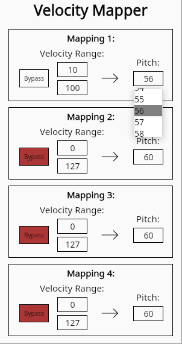

# VelocityMapper

A simple Midi Plugin which filters or changes the pitch of incoming Midi Notes depending on their velocity. 



This Plugin was built using the [nih_plug framework](https://github.com/robbert-vdh/nih-plug) and [vizia-plug](https://github.com/vizia/vizia-plug).

## Building

Precompiled binaries can be found in the [Releases tab](https://github.com/Leon-Focker/VelocityMapper/releases/)

After installing [Rust](https://rustup.rs/), you can compile BitFiddler yourself as follows:

```shell
cargo xtask bundle velocitymapper --release
```
